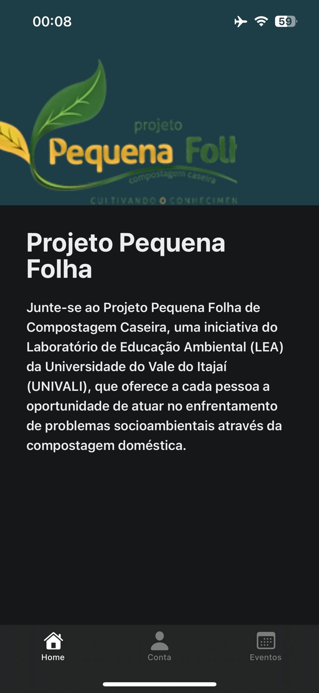
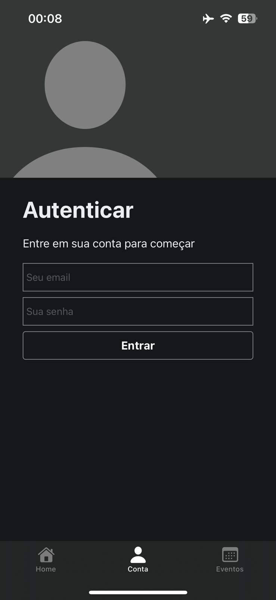
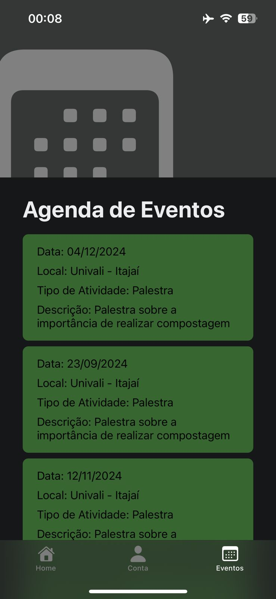

# Como executar o projeto em sua máquina

1. Clone o projeto em sua máquina com

`git clone https://github.com/BielSereia/pequena-folha.git`

2. Acesse a pasta do projeto
3. Abra o terminal
4. Instale as libs com

`npm ci`

5. Execute o projeto com

`npm run start`

6. Seja feliz :)

# Prints da aplicação

  
  
  

